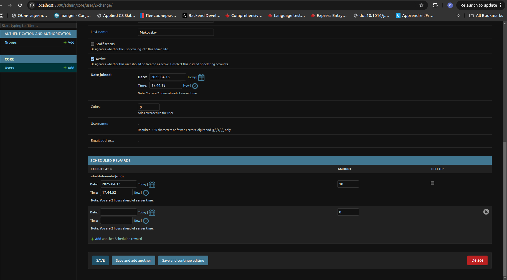
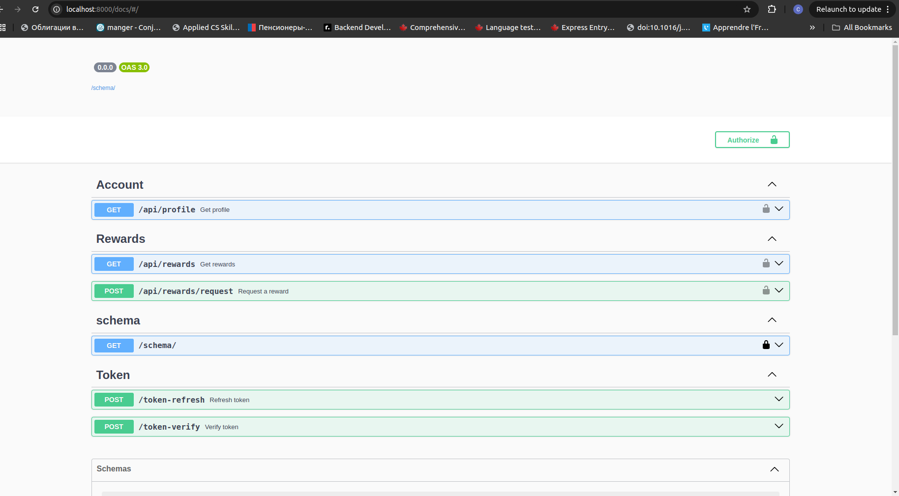

Admin panel


Swagger


API description
### 1. Retrieve Rewards

- **Endpoint:** `/api/rewards`
- **Method:** `GET`
- **Description:** Retrieves the list of rewards.
- **Response:**
  - **200 OK** - Successfully retrieved scenarios.
    ```json
    {
      "count": 2,
      "next": null,
      "previous": null,
      "results": [
        {
          "id": 10,
          "amount": 100,
          "execute_at": "2025-04-11T18:00:00Z",
          "user": 1
        },
        {
          "id": 11,
          "amount": 200,
          "execute_at": "2025-04-12T12:00:00Z",
          "user": 1
        }
      ]
    }
    ```
  - **400 Bad Request** - Error due to invalid input.
  - **500 Internal Server Error** - Server-side error.


### 2. Request a reward Rewards

- **Endpoint:** `/api/rewards/request`
- **Method:** `GET`
- **Description:** Retrieves the list of rewards.
- **Request body**
  ```json
  {
  "amount": 100
  }

- **Response:**
  - **201 CREATED** - Success.
  ```json
    {
  "id": 12,
  "amount": 100,
  "execute_at": "2025-04-11T19:00:00Z",
  "user": 1
  }
    ```
- **400 Bad Request** - Error due to invalid input.
- **500 Internal Server Error** - Server-side error.

### 3. Retrieve profile info

- **Endpoint:** `/api/profile`
- **Method:** `GET`
- **Description:** Retrieves the profile.
- **Response:**
  - **200 OK** - Successfully retrieved profile.
  ```json
    {
  "id": 1,
  "email": "user@example.com",
  "first_name": "John",
  "last_name": "Doe"
    }
     
    ```
- **400 Bad Request** - Error due to invalid input.
- **500 Internal Server Error** - Server-side error.


### 4. Refresh token

- **Endpoint:** `token-refresh`
- **Method:** `POST`
- **Description:** Refresh token.
- **Request body**
  ```json
  {
  "refresh": "your_refresh_token"
  }
- **Response:**
  - **200 OK** - Successfully refreshed token.
  ```json
    {
    "access": "new_access_token"
    }
     
    ```
- **400 Bad Request** - Error due to invalid input.
- **500 Internal Server Error** - Server-side error.

### 5. Verify token

- **Endpoint:** `token-verify`
- **Method:** `POST`
- **Description:** Verify token.
- **Request body**
  ```json
  {
  "token": "your_access_or_refresh_token"
  }
- **Response:**
- **200 OK** - Successfully refreshed token.
- **400 Bad Request** - Error due to invalid input.
- **500 Internal Server Error** - Server-side error.


